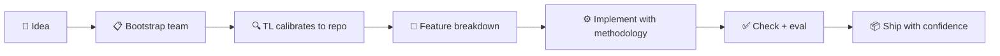

<div align="center">

# StackMoss

**Turn vague AI coding requests into a calibrated agent team that can actually ship.**

StackMoss bootstraps runtime-native agent teams for **Claude Code**, **Cursor**, **VS Code / Copilot**, **Codex**, and **Antigravity** from one deterministic source of truth.

[](https://www.npmjs.com/package/stackmoss)
[](LICENSE)
[]()
[](package.json)

</div>

---

Most AI coding setups stop at "here are some rules."

StackMoss goes further: it generates a **working team model** with roles, governance, methodology, calibration flow, and eval scaffolding — so your agents can plan, implement, review, and verify work with much less drift.

## 🎯 What StackMoss Gives You

After bootstrap, your repo is no longer just "prompted". It gets a team that can:

- 🏗️ Turn rough product intent into a **Tech Lead-first delivery flow**
- 👥 Break work into **18 specialized role lanes** — from TL, PM, BA through FE, BE, FS, MOBILE, DEVOPS, DATA, MLE, PE, and BRAND
- 📏 Enforce working discipline via **8 methodology modules**: planning, TDD, debugging, evidence, review, Git workflow, execution loop, and repo map maintenance
- 🎯 **Smart trigger descriptions** that activate the right role even when users don't use exact keywords
- 🔄 Recalibrate to the real repo instead of blindly following a template
- ✅ Run **trigger quality evals** and portable checks before you trust the team on real feature work

## ⚡ Before vs After

<table>
<tr>
<th>❌ Without StackMoss</th>
<th>✅ With StackMoss</th>
</tr>
<tr>
<td>

- Ask for a feature
- Agent guesses scope
- Implementation drifts
- Testing is inconsistent
- Docs and prompts go stale

</td>
<td>

- Intake captures intent + constraints
- Tech Lead calibrates to real repo
- Roles implement with word budgets
- QA verifies against acceptance criteria
- Eval loop catches behavioral drift

</td>
</tr>
</table>

### The Delivery Loop



## 🛡️ Built for Vibe Coding, But With Guardrails

StackMoss keeps the speed of vibe coding, but adds structure that prevents the usual chaos:

| What you get | Why it matters |
|:---|:---|
| Tech Lead-first workflow | One role owns architecture & coordination |
| Replace-only config updates | Prevents accidental config bloat |
| User confirmation gates | No surprise changes to shared team files |
| Runtime-native output per platform | Not one-size-fits-all prompt blobs |
| Trigger quality eval | Tests that skill triggers match real user prompts |
| Word budgets per capability | Agents stay concise, not verbose |

## 👥 Agent Roles

StackMoss ships **18 roles** organized into core team and specialized lanes:

| Role | ID | Capabilities |
|:---|:---|:---|
| Tech Lead | `TL` | Architecture, code review, context maintenance, planning |
| Product Manager | `PM` | **BRD discovery & brainstorming**, roadmap, prioritization, stakeholder alignment |
| Business Analyst | `BA` | Requirements elicitation, acceptance criteria |
| Developer | `DEV` | Implementation, environment knowledge, debugging |
| **Frontend** | `FE` | UI components, CSS/theming, accessibility, **design quality & anti-slop** |
| **Backend** | `BE` | API endpoints, database schema, authentication |
| **Fullstack** | `FS` | API-to-UI integration, scaffolding, performance |
| **Mobile** | `MOBILE` | Native UI, bundle/memory/battery, sensors/permissions |
| **DevOps Engineer** | `DEVOPS` | CI/CD, Docker/K8s/cloud, logging/alerting |
| **Data Engineer** | `DATA` | ETL pipelines, data modeling, data quality |
| **ML Engineer** | `MLE` | Model training, serving, monitoring, drift detection |
| **Prompt Engineer** | `PE` | System prompts, eval harness, chain orchestration |
| **UI/UX Designer** | `UIUX` | Design tokens, prototyping, usability reviews, **design audit & atmosphere config** |
| **Brand / Graphic** | `BRAND` | Brand identity, asset generation, style guides |
| Quality Assurance | `QA` | Test verification, regression checklists |
| Documentation | `DOCS` | README updates, changelog |
| Security-lite | `SEC` | Basic security checks |
| DevOps-lite | `OPS` | Deploy and infra checks |

Roles are **user-selectable** via multiselect during intake (with smart defaults based on persona × project type). Pick 🤷 **"Not sure"** to skip — Tech Lead will shape the team after finalizing the product spec. Each role includes **deep skill content** (Iron Law, process, anti-patterns, checklist) that Tech Lead can enrich with project-specific patterns via `ROLE_SKILL_OVERRIDES.md`.

## 📖 Methodology Modules

| Module | Scope | What it enforces |
|:---|:---|:---|
| TDD Cycle | DEV, QA | Red → Green → Refactor discipline |
| Debugging Protocol | DEV | Systematic error diagnosis |
| Evidence Gate | ALL | Claims require proof |
| Planning Protocol | TL | Parallel-friendly task clusters |
| Review Reception | ALL | Accept feedback gracefully |
| **Git Workflow** | ALL | Conventional commits, push before context loss |
| **Execution Loop** | ALL | TL assigns → DEV builds → QA audits → Ship/Block |

## 🎯 Runtime Targets

**One intake → five platforms.** StackMoss compiles the same roles, capabilities, and methodology into the native skill format of each runtime:

| Target | Output | Notes |
|:---|:---|:---|
| Claude Code | `CLAUDE.md` + `.claude/skills/<skill>/SKILL.md` | Role-level skills with YAML frontmatter |
| Cursor | `.cursor/skills/<skill>/SKILL.md` | Native Cursor Agent Skills |
| VS Code / Copilot | `.github/copilot-instructions.md` | Copilot Instructions format |
| Codex | `AGENTS.md` + `.agents/skills/<skill>/SKILL.md` | OpenAI Codex agent tree |
| Antigravity | `.agent/{skills,rules,workflows}` | Rules + workflows + skills |

## 🚀 Quick Start

Install:

```bash
npm install -g stackmoss
```

Use in an existing repo:

```bash
cd /path/to/repo
stackmoss init
```

Or create a fresh workspace:

```bash
stackmoss new my-project
cd my-project
```

Then:

1. Answer the intake (choose your roles with **Space**, confirm with **Enter**)
2. Open your runtime and chat with Tech Lead to calibrate
3. Set up GitHub repo + MCP servers for your runtime (see `README_AGENT_TEAM.md`)
4. Run `stackmoss check`
5. Run `stackmoss eval smoke`

Full walkthrough: [QUICK_START.md](QUICK_START.md)

## 📂 What Gets Generated

```text
my-project/
├── team.md                  # Shared team config (CONSTITUTION + roles + facts)
├── FEATURES.md              # Feature breakdown with appetite sizing
├── NORTH_STAR.md            # Locked product direction
├── NON_GOALS.md             # Explicit scope boundaries
├── ROLE_SKILL_OVERRIDES.md  # Project-specific role calibration
├── CALIBRATE.md             # Calibration checklist for Tech Lead
├── README_AGENT_TEAM.md     # MCP + GitHub setup guide
├── stackmoss.config.json    # Machine-readable config
├── .claude/skills/          # Claude Code skills
├── .cursor/skills/          # Cursor skills
├── .agent/                  # Antigravity rules + workflows
├── .agents/skills/          # Codex skills
├── .github/                 # Copilot instructions
├── REPO_MAP.md              # Repository structure map (agent-maintained)
└── evals/                   # Rubric + test cases + trigger eval
```

## ⌨️ Command Reference

| Command | Description |
|:---|:---|
| `stackmoss new <name>` | Create a new StackMoss workspace |
| `stackmoss init [name]` | Bootstrap StackMoss in the current repo |
| `stackmoss inject` | Scan an existing repo and sync migration facts |
| `stackmoss resolve` | Resolve migration questions |
| `stackmoss promote --confirm` | Move from `MIGRATING` to `OPERATIONAL` |
| `stackmoss run <alias>` | Run a command alias with patch proposal on failure |
| `stackmoss check` | Validate config, budgets, and calibration readiness |
| `stackmoss eval [profile] [--grade]` | Prepare or grade a live team evaluation |
| `stackmoss patch list/apply/reject` | Manage patch proposals |
| `stackmoss upgrade` | Merge `CONSTITUTION` only |
| `stackmoss map [--depth N]` | Generate or refresh `REPO_MAP.md` |

## 🧑‍💻 Development

```bash
git clone https://github.com/max-rogue/Stackmoss.git
cd Stackmoss
npm install
npm test
npm run build
```

Current local verification:

- **321 passing tests** across **42 test files**
- TypeScript build passes
- Deterministic: no LLM calls in the test suite

## 🙏 Acknowledgments

- **[taste-skill](https://github.com/Leonxlnx/taste-skill)** by [@lexnlin](https://x.com/lexnlin) — design engineering principles (AI tells, bias correction, atmosphere dials) distilled into FE and UIUX roles

## 📜 License

MIT Copyright StackMoss
